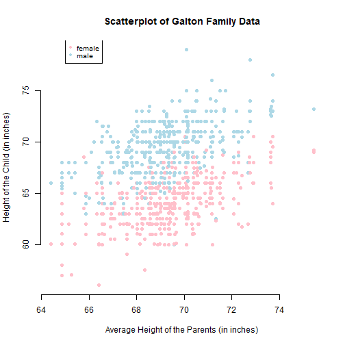

## About the Course Project

This is a deliverable for the course Developing Data Products as part of the Coursera Data Science Specialization.

Instructions:

1. Write a shiny application with associated supporting documentation. The documentation should be thought of as whatever a user will need to get started using your application.
2. Deploy the application on Rstudio's shiny server
3. Share the application link by pasting it into the provided text box
4. Share your server.R and ui.R code on github

---

## How to use the application

Using the data provided by Galton Families dataset, we fit a linear model to predict a child's height based on the gender and parent's average height.

The application is running on (https://r2po.shinyapps.io/course_project_shiny_appreproducible_pitch/)

ui.R, and Server.R Code in my github repository (https://github.com/nvudumula/Week-4-Developing-data-products)

---

## Galton Families Dataset

The data used in the app comes from the GaltonFamilies dataset. 


```r
library(HistData)
data(GaltonFamilies)
summary(GaltonFamilies)
```

```
##      family        father         mother      midparentHeight
##  185    : 15   Min.   :62.0   Min.   :58.00   Min.   :64.40  
##  066    : 11   1st Qu.:68.0   1st Qu.:63.00   1st Qu.:68.14  
##  120    : 11   Median :69.0   Median :64.00   Median :69.25  
##  130    : 11   Mean   :69.2   Mean   :64.09   Mean   :69.21  
##  166    : 11   3rd Qu.:71.0   3rd Qu.:65.88   3rd Qu.:70.14  
##  097    : 10   Max.   :78.5   Max.   :70.50   Max.   :75.43  
##  (Other):865                                                 
##     children         childNum         gender     childHeight   
##  Min.   : 1.000   Min.   : 1.000   female:453   Min.   :56.00  
##  1st Qu.: 4.000   1st Qu.: 2.000   male  :481   1st Qu.:64.00  
##  Median : 6.000   Median : 3.000                Median :66.50  
##  Mean   : 6.171   Mean   : 3.586                Mean   :66.75  
##  3rd Qu.: 8.000   3rd Qu.: 5.000                3rd Qu.:69.70  
##  Max.   :15.000   Max.   :15.000                Max.   :79.00  
## 
```

---

## Plot
In the scatterplot below are represented the data used for the prediction model

```r
library(HistData)
data(GaltonFamilies)
plot(jitter(GaltonFamilies$childHeight) ~ GaltonFamilies$midparentHeight,xlab="Average Height of the Parents (in inches)",ylab="Height of the Child (in inches)",main="Scatterplot of Galton Family Data",pch=19,frame.plot=FALSE,col=ifelse(GaltonFamilies$gender=="female", "pink", "light blue"))
legend(65,80,pch=c(19,19),col=c("pink","light blue"),c("female", "male"),bty="o",cex=.8)
```


widescreen: true

---

## Thank You!!


